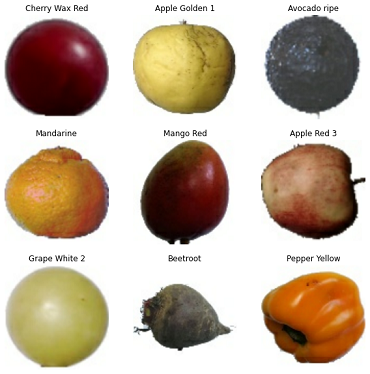

# IMAGE CLASSIFICATION ON PRODUCE


## Table of Contents
1. [Business Understanding](#1)
2. [Data Analysis](#2)
3. [Modeling](#3)
4. [Conclusions](#4)
5. [Recommendations](#5)


## <a name="1">STAKEHOLDER AND BUSINESS UNDERSTANDING</a>

Having reliable access to fresh produce is one of the most important selling points for grocery stores.  I have been tasked by a local green grocer, Four Courners Marketplace, who has been recently impacted by increased traffic and a switch of shipment providers. My goals are to implement a system that can quickly and accurately identify produce. This will increase both the quality of produce being shipped in, as well as potentially speeding up the self-checkout experience, which will in turn increase customer turnaround during busy hours.

## <a name="2">DATA  &  DATA ANALYSIS</a>

I utilized data sourced from the Fruits 360 datset on Kaggle (linked at the bottom of this document). This contained over 65,000 images of fruits and vegetables in 131 different classes for identification. Because the data was pre split, I decided to use Keras' own preprocessing techniques to do a split of my own on their training folder. Preparing the images required me to convert them into Arrays of numbers that Tensorflow can then interpret and make predictions based off of. I was able to then convert them back into images and print them out to show they were successfully loaded.



## <a name="3">MODELING</a>

For all of my models included I used the 'Sequential' model from Keras. This allowed me to create and weave custom layers into my own Convoluted Neural Network to train the image set with.

### BASELINE


My baseline model actually performed very well! I only put in the bare minimum required for it to be properly run and it almost hit 93% accuracy! Not bad at all. Going forward the most obvious way to improve our model is to add complexity through layering. Keras allows us to do this very simply, it's as easy as copy and paste.


### ITERATING


During the modeling process I decided to try and change some of my parameters to see how it impacted performance. Normall when you shrink a window for the network it improves accuracy. In my case however, it tanked both accuracy and loss. Because of this reason I set my windows back to 4, 4 after running this.

### FINAL


Thanks to a combination of previous techniques and a metric ton of patience, I was able to achieve 99% accuracy for predictions with my model! All of this after only 3 epochs used as well!


Taking a look at our loss, we can see that the intersect happens right around when we stopped modeling. This is ideal because we don't need to run our model with any more epochs to increase performance (at the cost of computational time).

## <a name="4">CONCLUSIONS:</a>

Using deep learning is incredibly efficient for image classification models, and far easier to control than I thought as well. The most important thing I can conclude about Tensorflow and classifications using neural networks is: Size matters. The model can only be as trained as there are instances to train on! With access to data becoming more and more publicly available, it's never been easier.

## <a name="5">RECOMMENDATIONS:</a>

- Implement my model to accurately predict different fruit and vegetables and increase customer turnaround.
- Set up scanners at the warehouse to check incoming produce for mold/rot.
- Set up a custom list of produce to create a more personalized classification system.


## File Structure
```
.
├── figures/         <- Folder containing the pictures for this readme
├── .gitignore       <- Standard gitignore
├── FINAL_NB.ipynb   <- Finalized jupyter notebook for submission
├── README.md        <- This file!
├── presentation.pdf <- PDF of my powerpoint slides
└── web_app.ipynb    <- Notebook containing code for a web application
```
#### ALL DATA SOURCED FROM: https://www.kaggle.com/datasets/moltean/fruits
