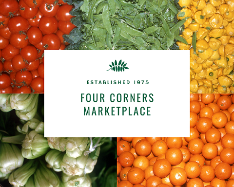
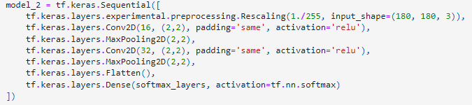

# IMAGE CLASSIFICATION ON PRODUCE



## Table of Contents
1. [Business Understanding](#1)
2. [Data Analysis](#2)
3. [Modeling](#3)
4. [Recommendations](#4)
5. [Moving Forward](#5)


### ALL DATA SOURCED FROM: https://www.kaggle.com/datasets/moltean/fruits

## <a name="1">STAKEHOLDER AND BUSINESS UNDERSTANDING</a>

For me, checkout at a grocery store is always the biggest hassle of going. Will I remember any of the codes for the produce I commonly buy? I have been tasked by a local green grocer to implement an image classification application to identify and predict what produce is being scanned to increase efficiency and customer turnaround.

## <a name="2">DATA  &  DATA ANALYSIS</a>

I utilized data sourced from the Fruits 360 datset on Kaggle (linked above). This contained over 65,000 images of fruits and vegetables in 131 different classes for identification. Because the data was pre split, I decided to use Keras' own preprocessing techniques to do a split of my own on their training folder. 

## <a name="3">MODELING</a>
For all of my models included I used the 'Sequential' model from Keras. This allowed me to create and weave custom layers into my own Convoluted Neural Network to train the image set with.

### BASELINE


My baseline model actually performed very well! I only put in the bare minimum required for it to be properly run and it almost hit 93% accuracy! Not bad at all. Going forward the most obvious way to improve our model is to add complexity through layering. Keras allows us to do this very simply, it's as easy as copy and paste.


### ITERATING



During the modeling process I decided to try and change some of my parameters to see how it impacted performance. Normall when you shrink a window for the network it improves accuracy. In my case however, it tanked both accuracy and loss. Because of this reason I set my windows back to 4, 4 after running this.

### FINAL


Thanks to a combination of previous techniques and a metric ton of patience, I was able to achieve 99% accuracy for predictions with my model! All of this after only 3 epochs used as well!


Taking a look at our loss, we can see that the intersect happens right around when we stopped modeling. This is ideal because we don't need to run our model with any more epochs to increase performance (at the cost of computational time).

## <a name="4">CONCLUSIONS:</a>

With an accuracy of over 99%, it's hard not to recommend this model for use. It has gone above and beyond what I had hoped to achieve using Keras!

## <a name="5">FUTURE CONSIDERATIONS:</a>

Given any specific stakeholder, I could tailor a dataset to only have produce that their store would carry. In addition I would love to try to implement an application that can show off the models and let a user try it out for themself.

## File Structure
```
.
├── figures/         <- Folder containing the pictures for this readme
├── .gitignore       <- Standard gitignore
├── FINAL_NB.ipynb   <- Finalized jupyter notebook for submission
├── README.md        <- This file!
├── presentation.pdf <- PDF of my powerpoint slides
└── web_app.ipynb    <- Notebook containing code for a web application
```
