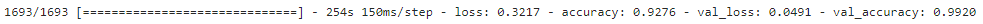

# IMAGE CLASSIFICATION ON PRODUCE

ALL DATA SOURCED FROM: https://www.kaggle.com/datasets/moltean/fruits

## STAKEHOLDER AND BUSINESS UNDERSTANDING 


## DATA  &  DATA ANALYSIS
I utilized data sourced from the Fruits 360 datset on Kaggle (linked above). This contained over 65,000 images of fruits and vegetables in 131 different classes for identification. Because the data was pre split, I decided to use Keras' own preprocessing techniques to do a split of my own on their training folder. 
## MODELING
For all of my models included I used the 'Sequential' model from Keras. This allowed me to create and weave custom layers into my own Convoluted Neural Network to train the image set with.

### BASELINE


My baseline model actually performed very well! I only put in the bare minimum required for it to be properly run and it almost hit 93% accuracy! Not bad at all. Going forward the most obvious way to improve our model is to add complexity through layering. Keras allows us to do this very simply, it's as easy as copy and paste.


### ITERATING


### FINAL


## CONCLUSIONS:


## FUTURE CONSIDERATIONS:


## File Structure
```
.
├── .gitignore       <- Standard gitignore
├── FINAL_NB.ipynb   <- Finalized jupyter notebook for submission
├── README.md        <- This file!
├── presentation.pdf <- PDF of my powerpoint slides
└── web_app.ipynb    <- Notebook containing code for a web application
```
